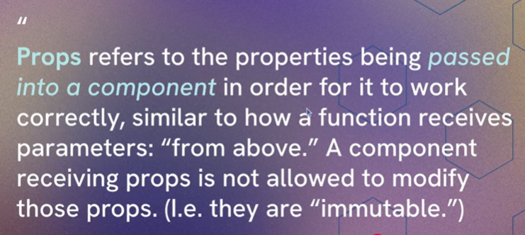
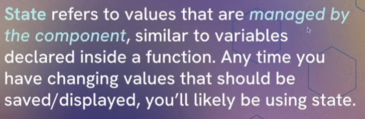
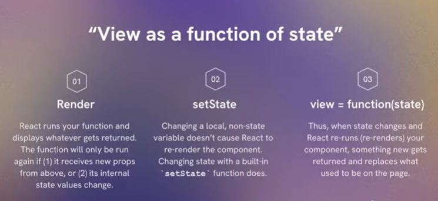
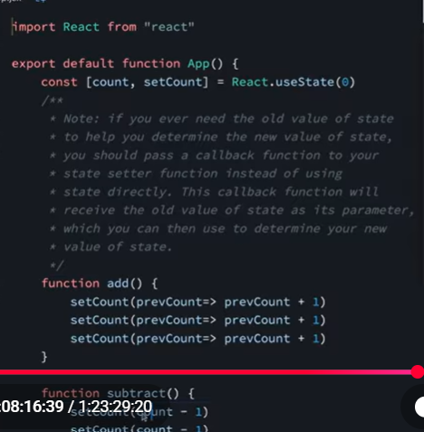

1. You have 2 options for what you can pass in to a
   state setter function (e.g. `setCount`). What are they?
   1. pass the new version of state that we want to use as the replacement for the old version of state.
   2. Pass a callback function. Must return what we want the new value of state to be. Will receive the  old version of state as a parameter so we can use it to  help determine what we want the new value  of state to be. 

2. When would you want to pass the first option (from answer
   above) to the state setter function?
Whenver we don't really care about or need the old value, we simply want to set a new value. 

3. When would you want to pass the second option (from answer
   above) to the state setter function?
Whenver we do care about the previous value in state and need it to help us determine what the new value should be.

## Conditional rendering 

1. What is "conditional rendering"?

when we want to only sometimes display on the page based on some kind of conditions

2. When would you use &&?

When you want to either display something or not display something

3. When would you use a ternary?

When you need to decide which of 2 things to display

4. What if you need to decide between > 2 options on
   what to display?

if else switch 